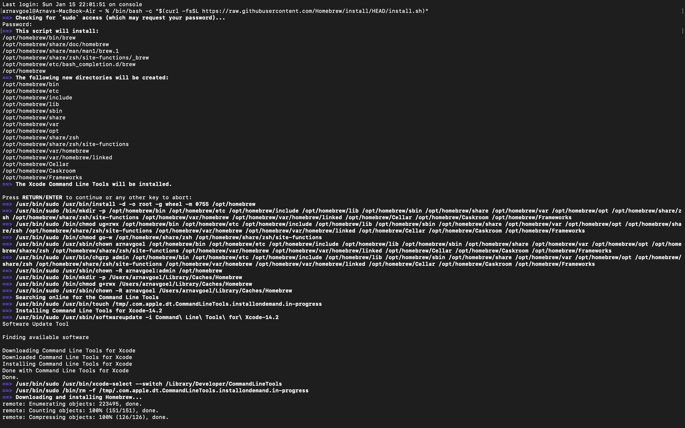
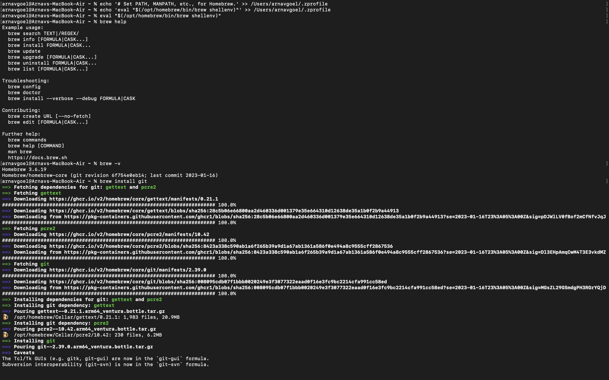
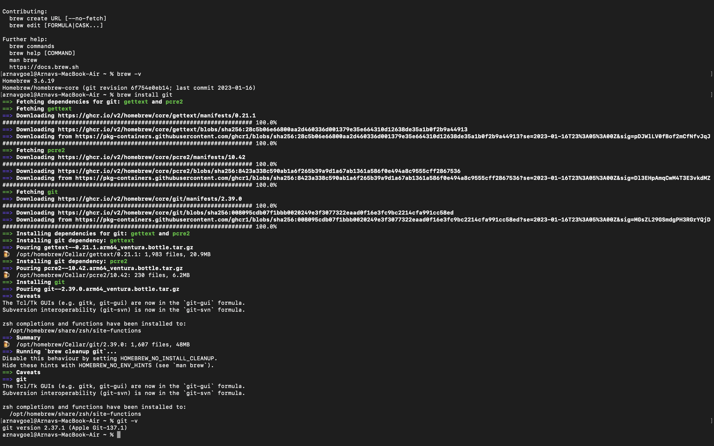

# Making Github Websites as a UCSD student

## 1. Setting up your CSE 15l account
  - [Log in](https://sdacs.ucsd.edu/~icc/index.php) to your account by using the username and your unique PID 
  - ![][add1.png]
  - Click on your unique course id enclosed inside the gray box
  - Click on the change password hyperlink on the next webpage that is opened up on your end 
- Follow the on-screen instructions to change the password of your course specific account
## 2. Installing vs code 
- Intall visual studio code using this [link](https://code.visualstudio.com/)
- 
- Follow the intructions on the dialog boxes after downloading and running the .dmg file.
## 3. Remotely connecting to server 
For mac user such as myself, there are mutiple ways to install and set up git.
I chose to install it through a package manager for MacOS named HomeBrew.

  ### Home Brew installation
  - Click on this [Link](https://brew.sh)
  - 
  - Paste the commond line argument into the terminal to start the installation of homebrew
- After a few mintues once the Homebrew installation is finished

## 4. Running basic Commands

